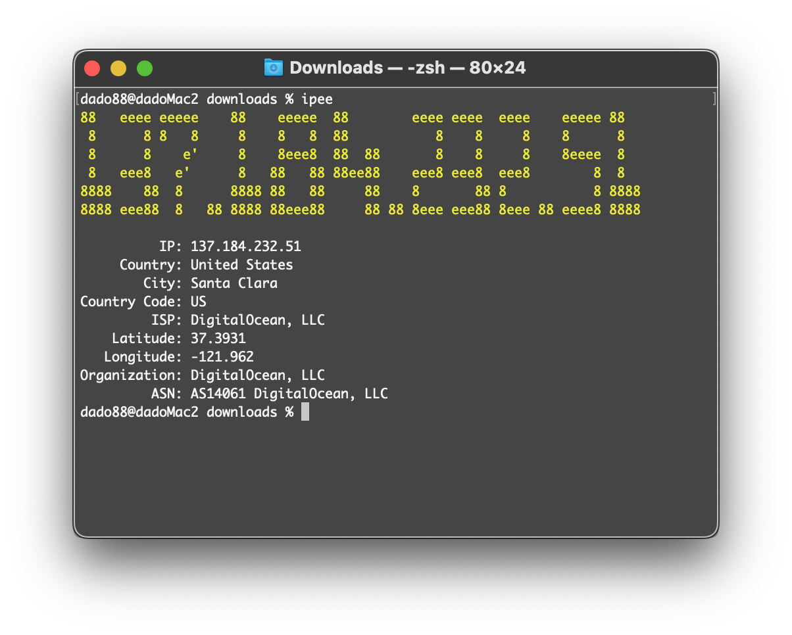

# ipee
Simple command line interface tool to get information about your public IP address. Also my first program written in C#.
 Binaries can be found in the 'Releases' section. <b>Requires .NET 7.0 or later.</b>

	

## Credits
- <a href="https://ip-api.com">ip-api.com - IP Geolocation API</a>
- <a href="https://github.com/drewnoakes/figgle">Figgle - ASCII banner generation for .NET</a>

## License
ipee is open-source and licensed under the <a href="https://choosealicense.com/licenses/gpl-3.0/">GNU General Public License v3.0</a>.